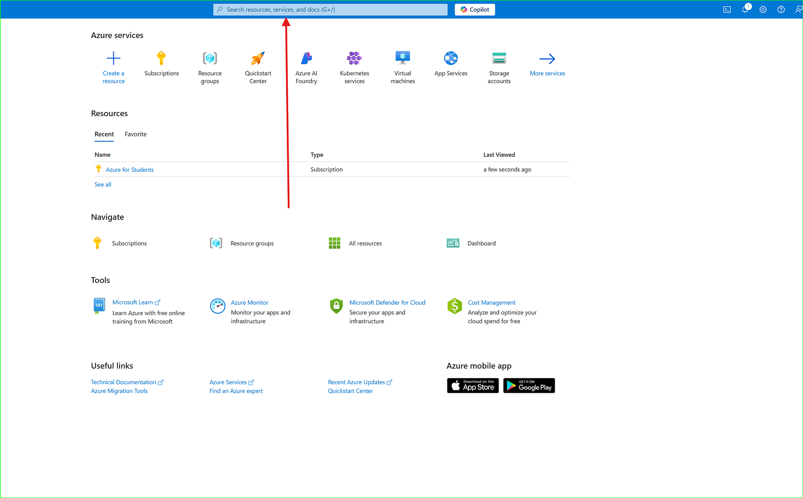
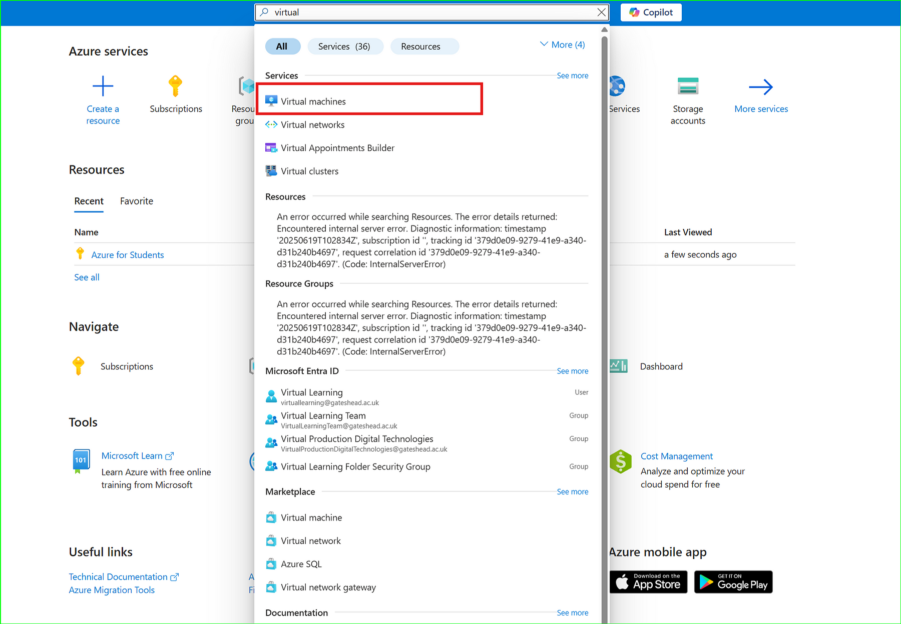
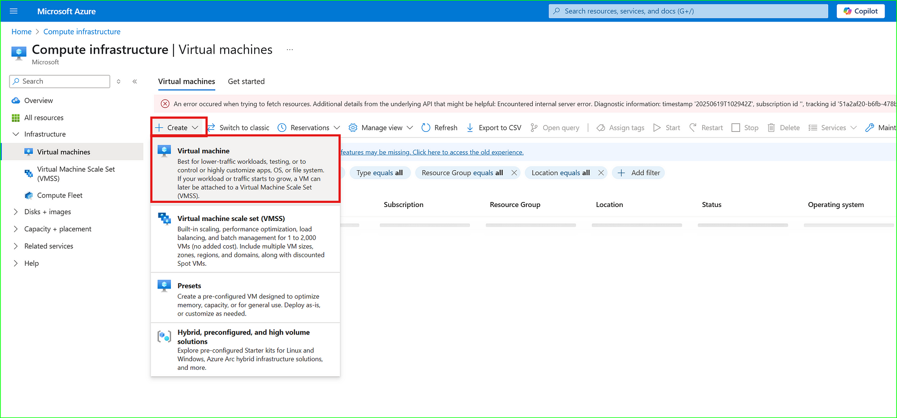
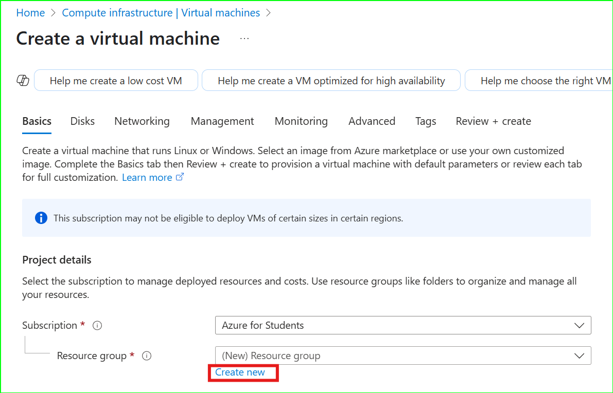
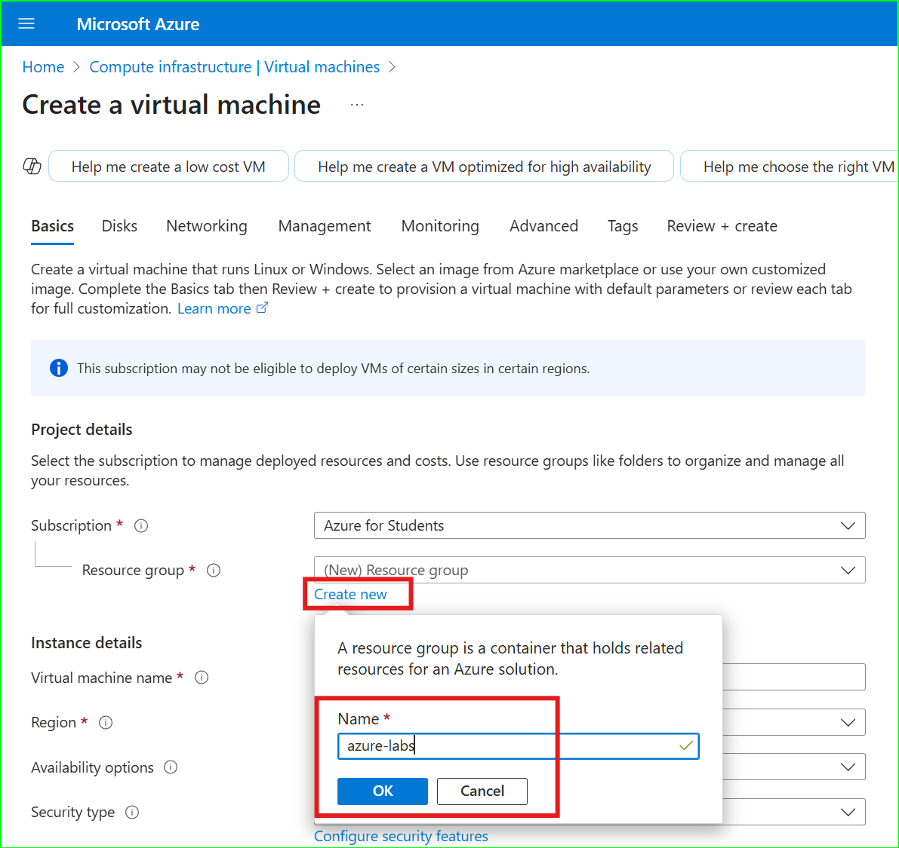
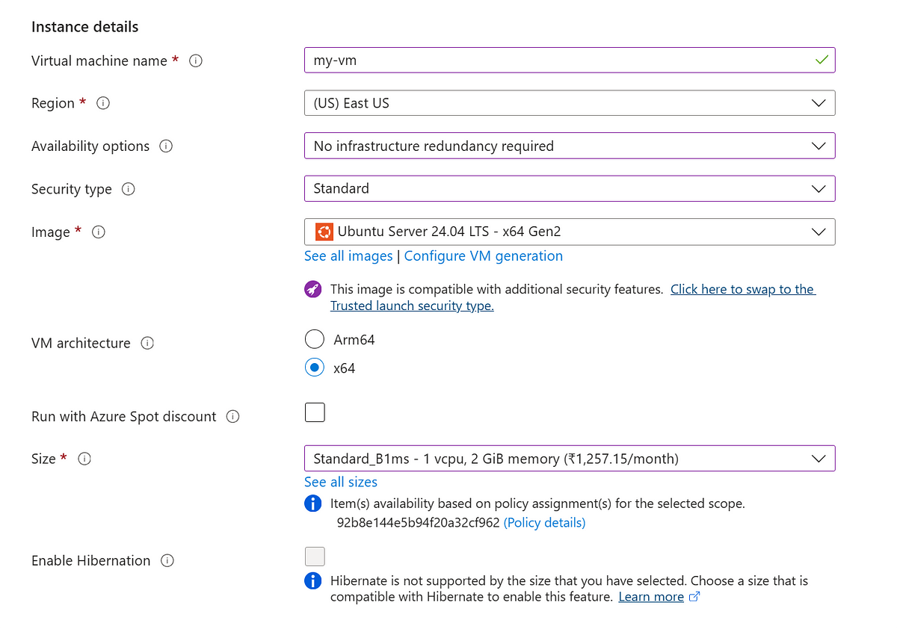
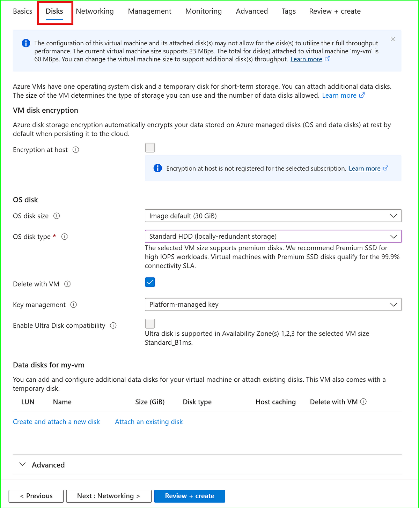

# 🚀 Lab 1: Create an Azure VM and Connect via SSH Using `.pem` File

---

## ✅ Prerequisites

- Azure account: [https://portal.azure.com](https://portal.azure.com)  
- Active/free subscription

---

## 🧭 Step-by-Step Instructions

After logging in to Azure Portal:



---

## 🔍 1. Search for Virtual Machine

Type **"virtual machine"** in the search bar.



---

## ➕ 2. Create a Virtual Machine

Inside **Virtual Machines**:
- Click **+ Create**
- Select **Virtual machine**



---

## ⚙️ 3. Configure the VM

- VM name: `my-vm`  
- Region: East US  
- Availability options: Skip  
- Security type: Standard  
- Image: Ubuntu Linux 24.04  
- Architecture: x64  
- Spot instance: No  
- Size: 1 CPU, 2 GB RAM



---

## 🔐 4. SSH Key Pair & Access

- Login method: SSH public key  
- Username: `azureuser`  
- Generate new key pair → `my-key.pem`  
- SSH Key type: RSA  
- Open port 22 for SSH access



---

## 🌐 5. Networking Concepts

- **VNet** – Like a private internet in Azure  
- **Public IP** – Needed for your laptop to connect  
- **NIC** – Virtual LAN port  
- **NSG** – Basic firewall  
- **Inbound Ports** – Like "doors" for traffic



---

## 🧱 6. Configure Network

- VNet: `my-virtual-network`  
- Address range: `10.0.0.0/16` (65K IPs)  
- Subnet: `10.0.0.0/24` (256 IPs)


---

## 🔑 7. Download SSH Key

Azure warns you:
> You won’t be able to download the key again.

Click **Download private key and create resource**



---

## 💻 8. Connect via SSH

Open Git Bash and run:

```bash
cd downloads
chmod 400 my
