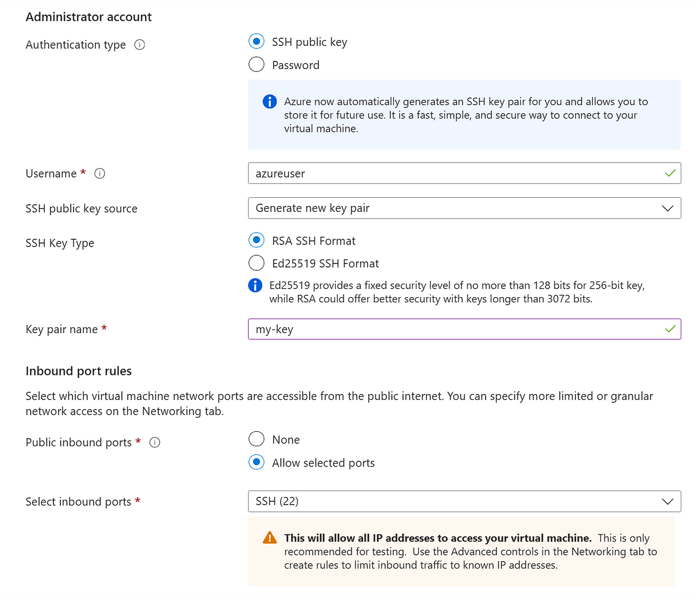

## 🧪 Lab 1: Create an Azure VM and Connect via SSH Using `.pem` File

In this lab, I demonstrate how to launch a secure Ubuntu Virtual Machine on Microsoft Azure and connect to it using SSH with a `.pem` key. The steps include setting up the VM, configuring network rules, downloading the SSH key, and connecting from your terminal.

📸 This GitHub version includes step-by-step screenshots (`1.png` to `16.png`) to help you visually follow the process.

🔗 For full explanations, tips, and detailed guidance, please read the complete tutorial on my Medium article:

👉 **[Follow the full lab with explanations on Medium]([#](https://medium.com/@sirohi-v/lab-1-create-an-azure-vm-and-connect-via-ssh-using-pem-file-15b3e28ec93a))** ← *(Insert your Medium link here)*  
Don’t forget to give it a read and a follow if you find it helpful! 🙌

