# ⚡ Lab 3: Deploying an Azure Function App (HTTP Trigger)

In this lab, you'll learn how to deploy and test your first **Azure Function App** using an **HTTP Trigger** — a lightweight, serverless solution for event-driven workloads.

---

### 🎯 What You’ll Learn:
- What Azure Functions are and where they fit in cloud computing
- How to deploy a Function App via the Azure Portal
- How to create and test an HTTP-triggered function
- When (and when not) to use Azure Functions

---

📁 This folder contains step-by-step **screenshots (1 to 18)** to visually guide you through every click.

🧠 **BUT...** to understand the *why* behind each step, including fun facts and real-world context:

👉 **[Read the full article here](https://medium.com/@your-username)** for the complete learning experience!

---

### 📸 Visual Walkthrough (Screenshots)

| Step | Screenshot |
|------|------------|
| 1 | 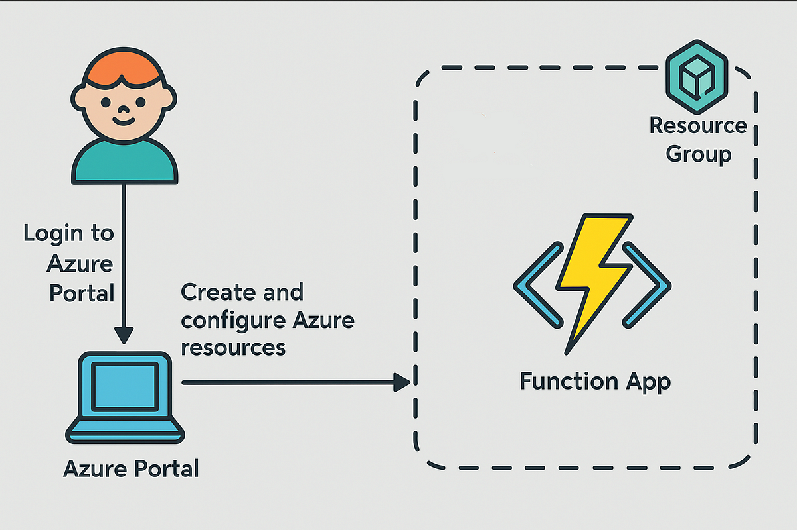 |
| 2 | 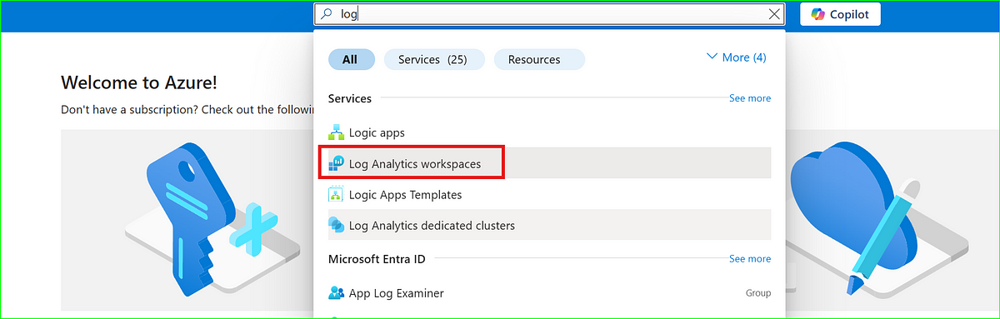 |
| 3 | 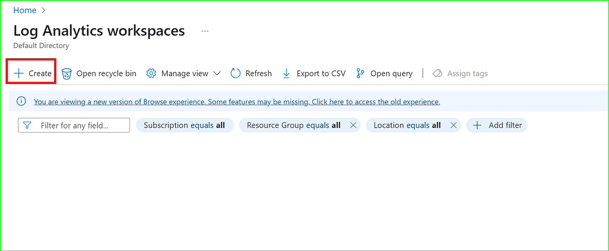 |
| 4 | 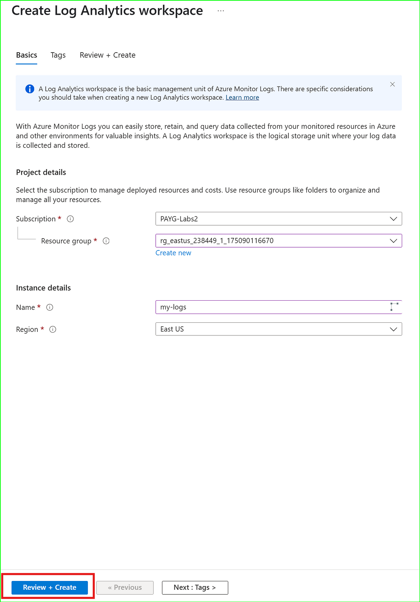 |
| 5 | 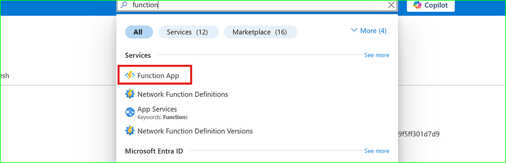 |
| 6 | 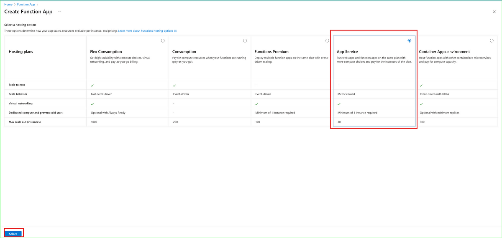 |
| 7 | 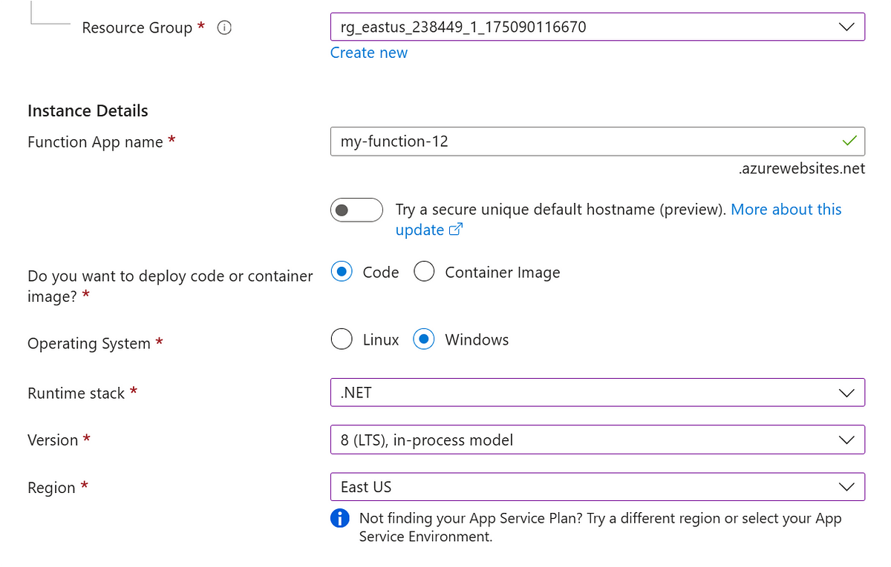 |
| 8 | 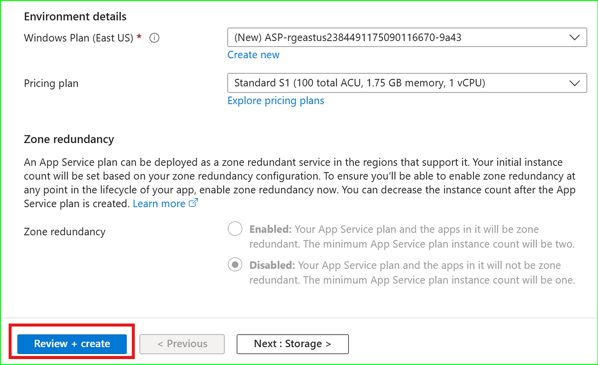 |
| 9 | 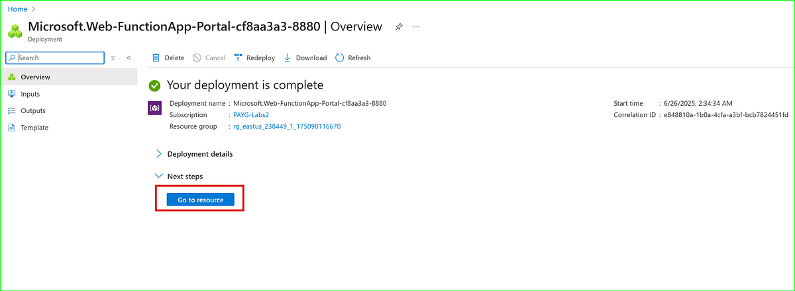 |
| 10 | 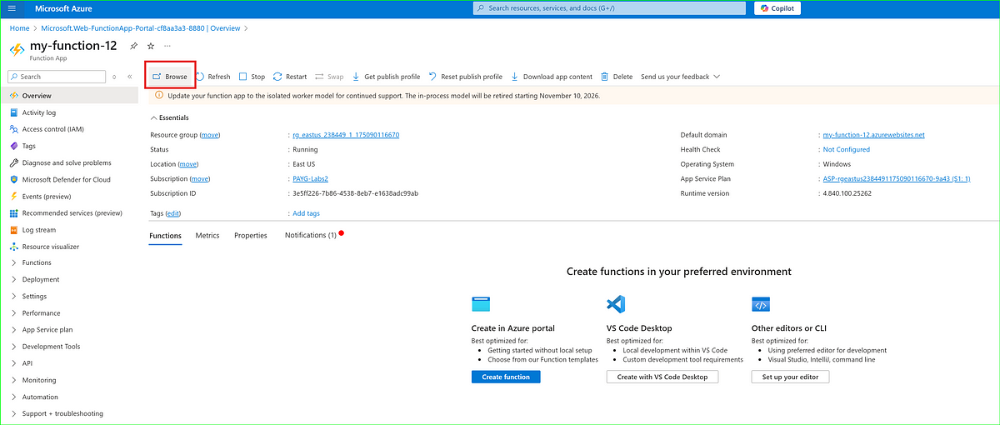 |
| 11 | 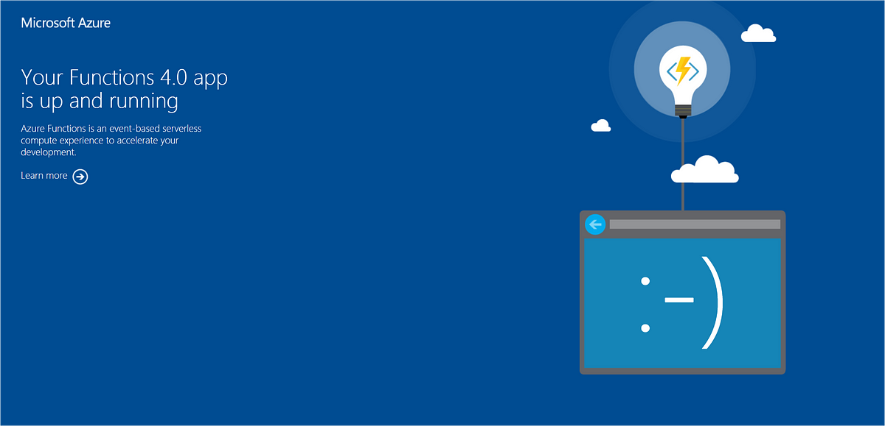 |
| 12 | 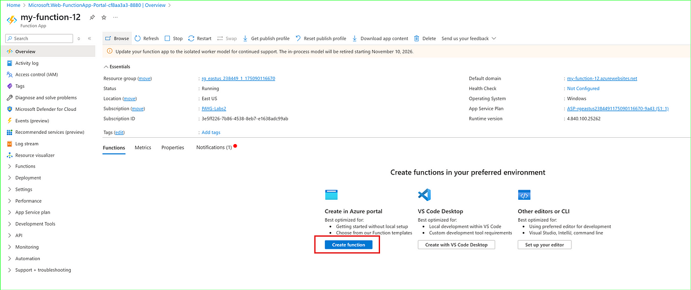 |
| 13 | 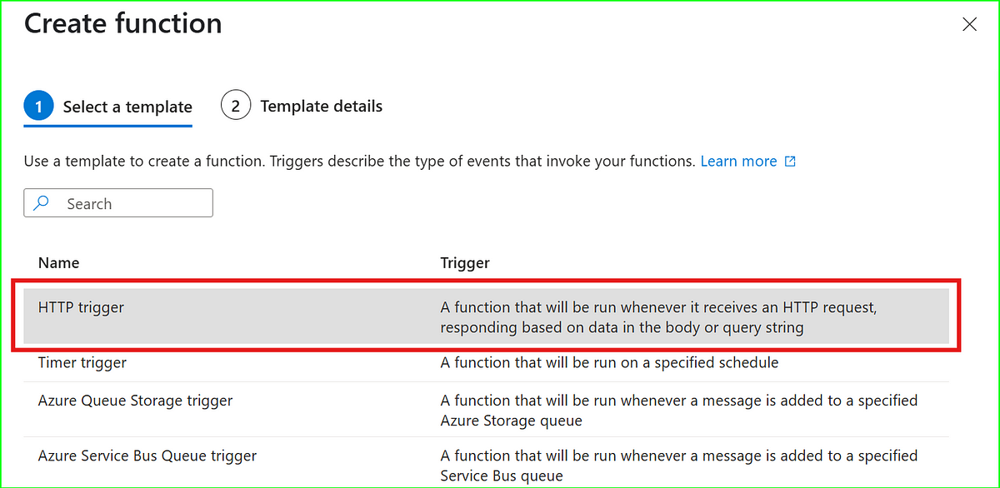 |
| 14 | 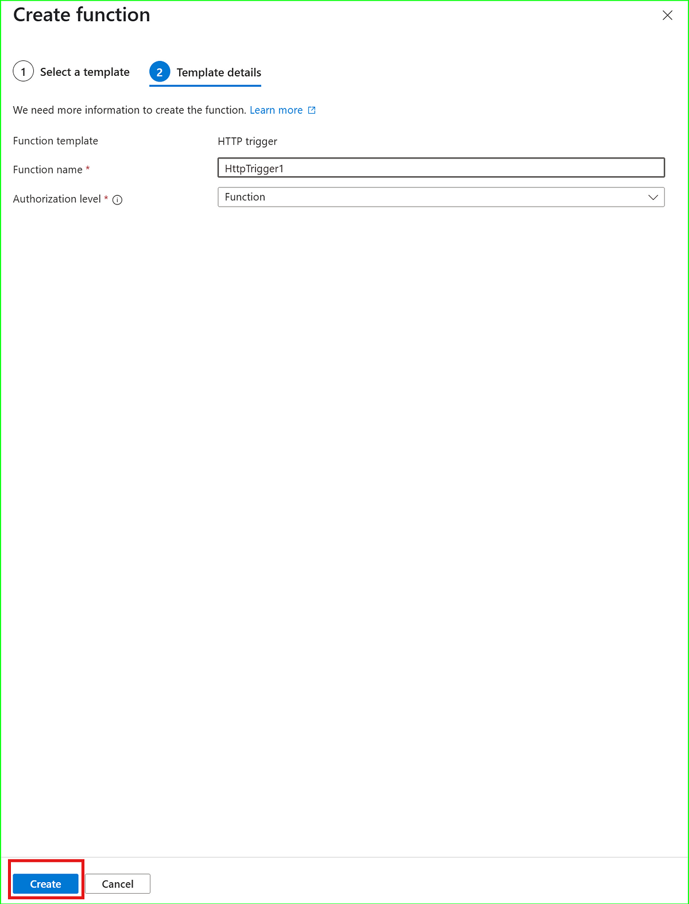 |
| 15 | 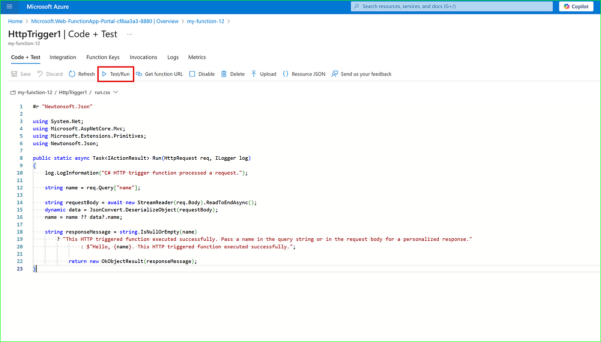 |
| 16 | 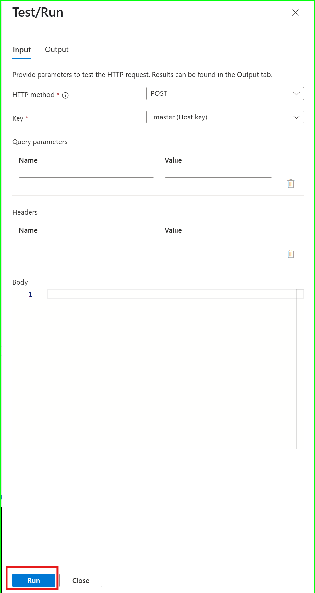 |
| 17 | 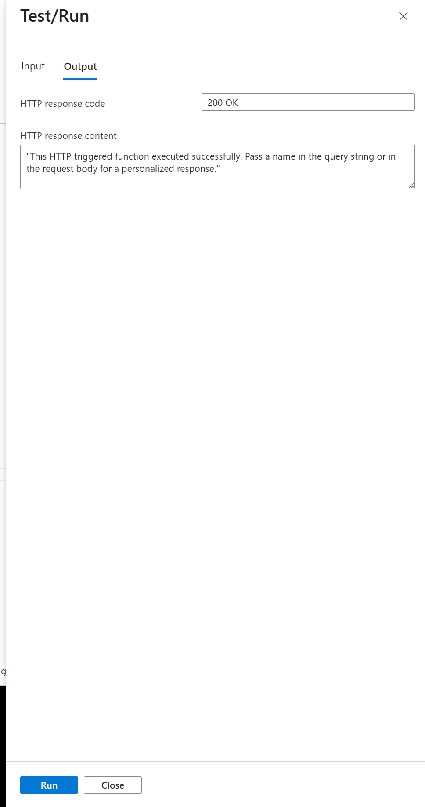 |
| 18 | 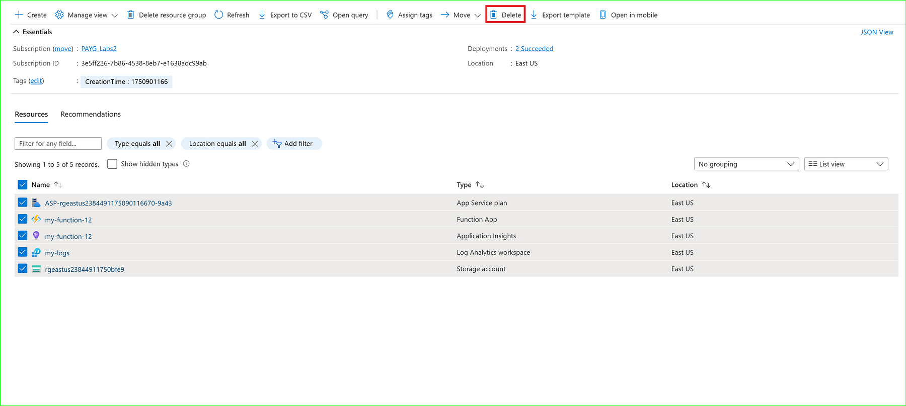 |
