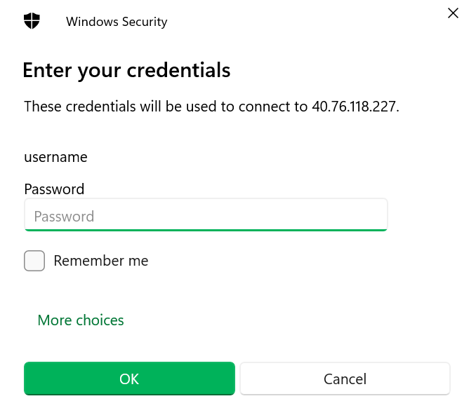
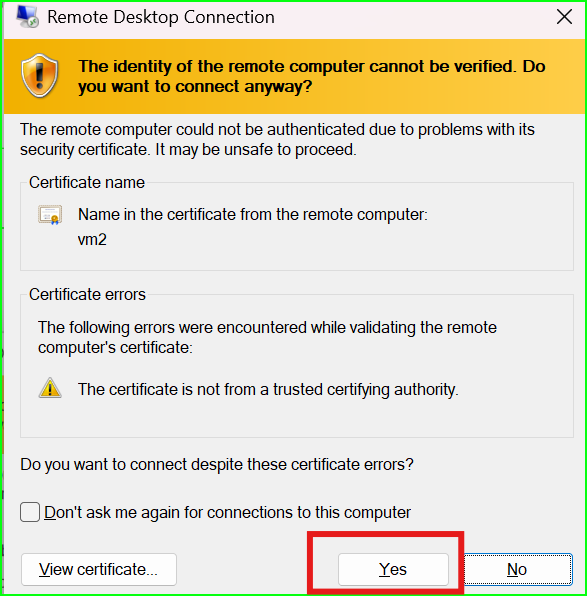
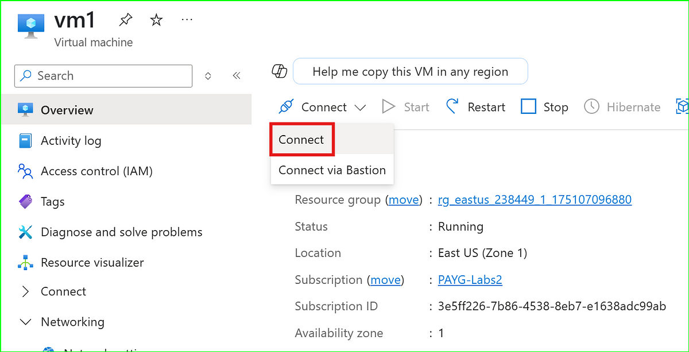

## ⚡ Lab 5: Create Azure Virtual Network and Connect Two VMs Internally (via Ping/ICMP)

In this lab, you'll learn how to create a **Virtual Network** and deploy two **Windows Virtual Machines** inside it. You'll configure them so they can talk to each other internally — using `ping`, a common network testing command!

Perfect for understanding the basics of Azure networking, internal communication, and firewall/port rule setup. 🔐

---

### 🧠 What You’ll Learn:

- What Azure Virtual Networks (VNets) are and why they matter
- How to create a custom VNet with IP ranges and subnets
- How to deploy Windows VMs inside a VNet
- How to use Network Security Groups (NSGs) to allow or block traffic
- How to connect to VMs using RDP (Remote Desktop)
- How to enable internal communication between two VMs using ICMP/ping

📁 This folder contains step-by-step **screenshots** to walk you visually through each task of the lab.

💡To dive deeper into the “why” behind each step (and see fun facts 😄), check out the full article on Medium.

---

### 📖 Read the full tutorial here:

🧾 [Lab 5 – How to Set Up Internal VM Communication Using Azure Virtual Network](https://medium.com/@sirohi-v/lab-5-built-azure-vnet-with-windows-vms-and-configured-internal-ping-connectivity-60ac777bd723)

---

### 🖼️ Visual Walkthrough (Screenshots)

| Step | Screenshot |
|------|------------|
| 0 |  |
| 1 |  |
| 2 |  |
| 3 |  |
| 4 |  |
| 5 |  |
| 6 |  |
| 7 |  |
| 8 |  |
| 9 |  |
| 10 |  |
| 11 |  |
| 12 |  |
| 13 |  |
| 14 |  |
| 15 |  |
| 16 |  |
| 17 |  |
| 18 |  |
| 19 |  |
| 20 |  |
| 21 |  |
| 22 |  |
| 23 |  |
| 24 |  |
| 25 |  |
| 26 |  |
| 27 |  |
| 28 |  |
| 29 |  |
| 30 |  |
| 31 |  |
| 32 |  |
| 33 |  |
| 34 |  |
| 35 |  |
