# 🌐 Lab 6: Setting Up DNS Zone & Records on Azure

In this lab, you’ll learn how to create a **DNS Zone** in Azure and configure a custom **A Record** to point your domain to an IP address.

---

This lab helps you understand:
- 🗂 What a DNS Zone is and why it's important  
- 📌 How to create and manage DNS records (like A records)  
- 🧪 How to test your DNS setup using `nslookup`  
- 🧹 How to clean up resources after use to avoid charges

---

🖼 **This folder contains step-by-step screenshots** so you can follow along visually.

💡 **But for full context and clear beginner-friendly explanations:**

👉 **You must read the full article** on Medium for best results.

---

### 📚 Read the full tutorial here:

[**Lab 6: Azure DNS Lab – Create DNS Zone and Records (Full Guide)**](https://medium.com/@sirohi-v/lab-6-see-how-i-built-a-custom-domain-on-azure-dns-in-minutes-8f4a6b9eb904)

---

💬 *“This lab not only shows the steps, but also explains core DNS concepts, real-world use cases, and fun facts — making it both practical and enjoyable!”*

🙌 Found this useful? Clap on Medium and follow for more Azure hands-on labs!

---

📸 **Visual Walkthrough (Screenshots)**

| Step | Screenshot |
|------|------------|
| 1 | 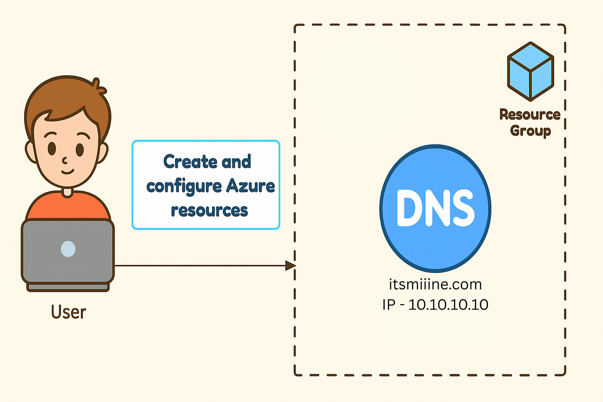 |
| 2 | 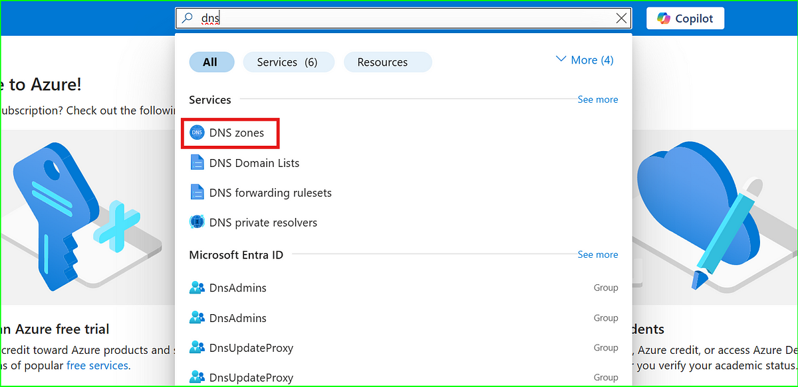 |
| 3 | 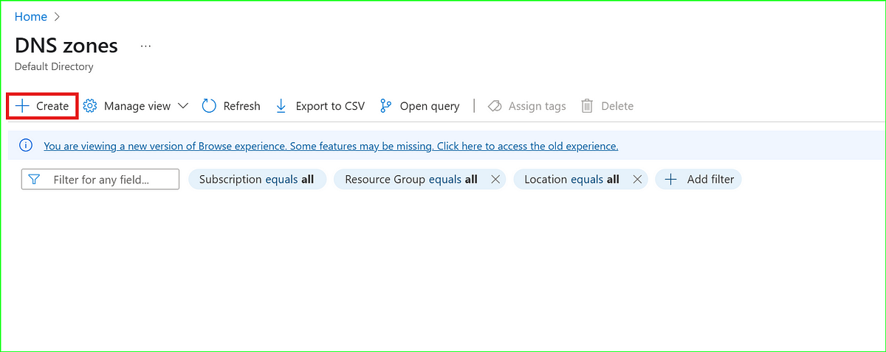 |
| 4 | 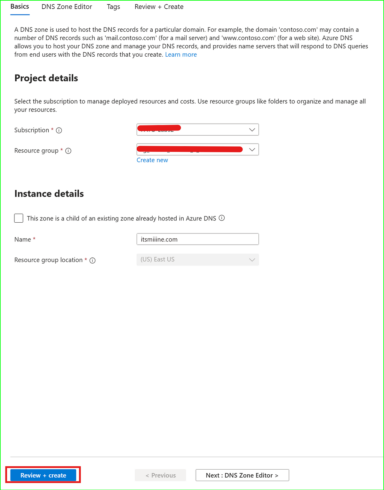 |
| 5 | 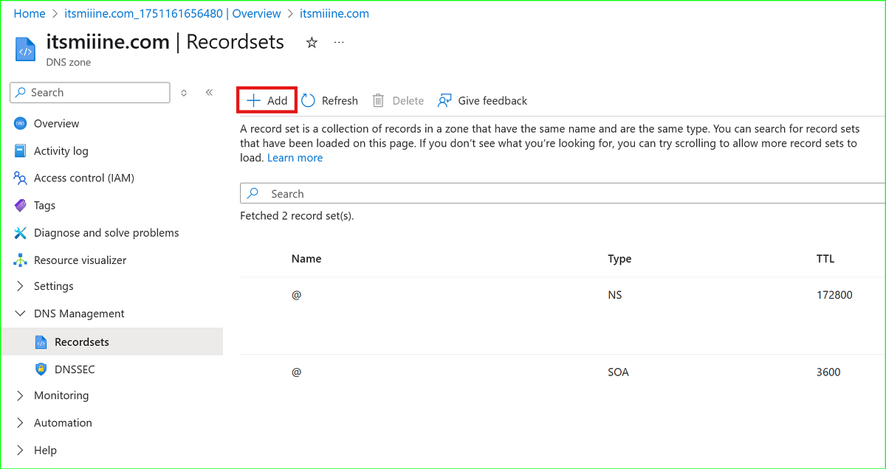 |
| 6 | 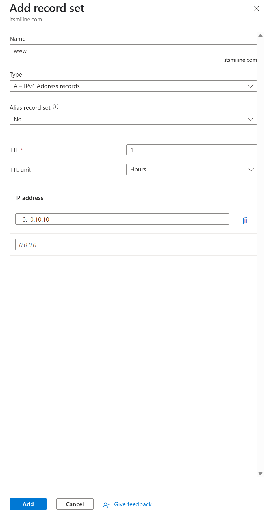 |
| 7 | 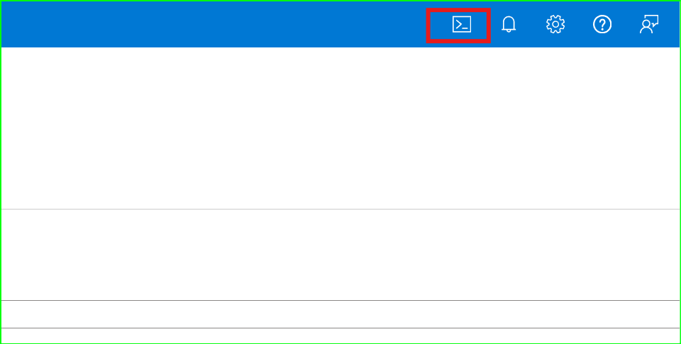 |
| 8 | 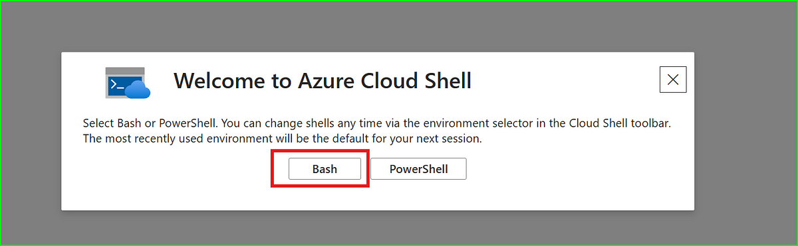 |
| 9 | 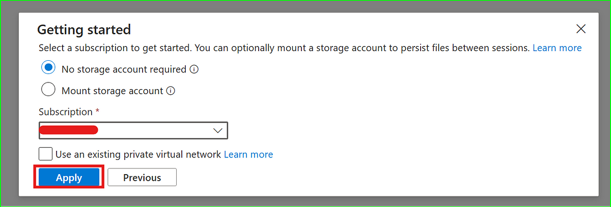 |
| 10 | 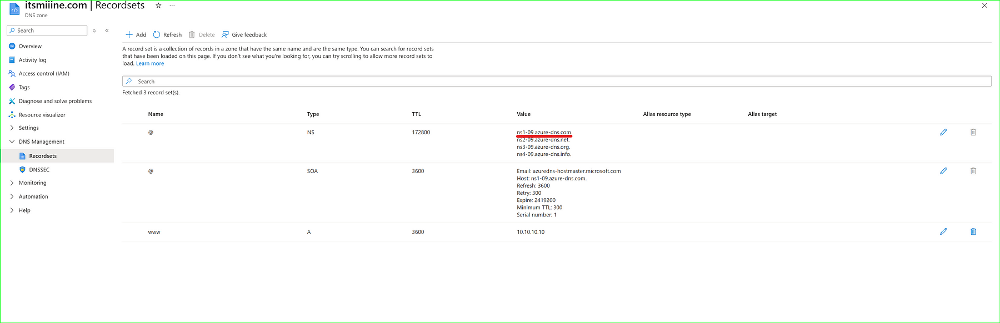 |
| 11 | 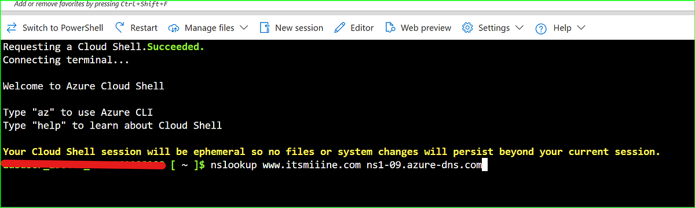 |
| 12 | 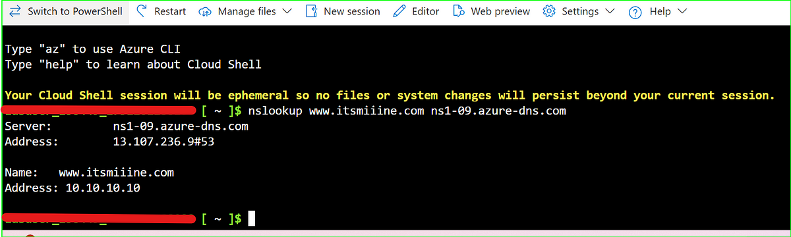 |
| 13 | 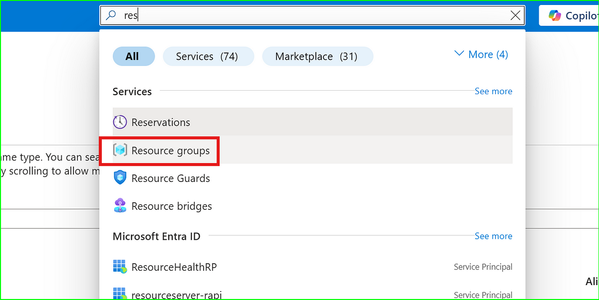 |
| 14 | 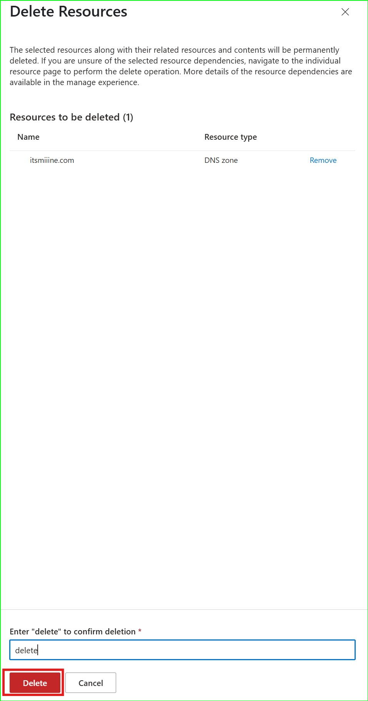 |

---

🧠 **Fun Fact:**  
DNS is like the internet’s phonebook! Without it, you’d have to remember long IP addresses instead of domain names like `www.amazon.com`.

🚀 Happy Learning & Keep Building in Azure!

