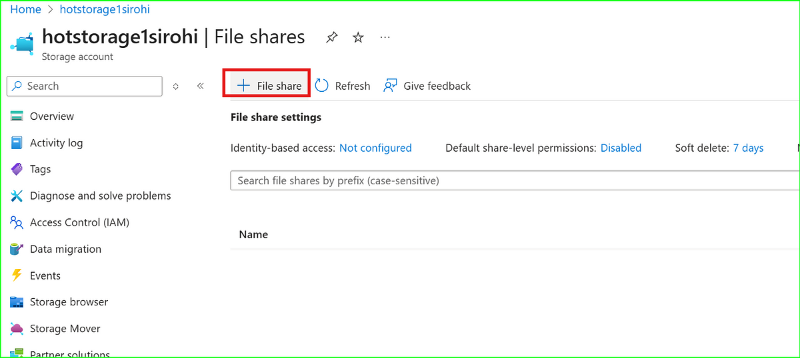
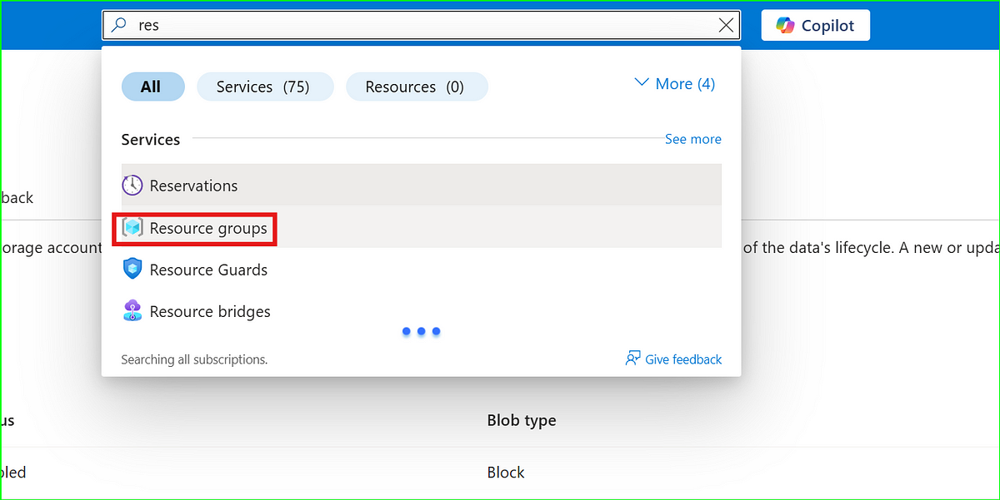

# 📦 Lab 7: Azure Storage Super Lab – Blob, File Share, Access Tiers, and Lifecycle Rules

In this lab, you'll work hands-on with **Azure Storage Accounts** to manage and optimize blob data, configure access levels, use archive rehydration, and implement lifecycle rules — all safe and designed for real-world application.

---

## ✅ What you'll learn:
- How to create and configure Azure Storage Accounts
- What Blob Containers are and how to manage them
- Upload, edit, and secure files using Blob Access Levels
- Rehydrate data from Archive tier to Hot
- Create and use Azure File Shares for hybrid access
- Automate storage cost savings using Lifecycle Management rules

---

📌 **This folder contains step-by-step screenshots** so you can follow along visually.  
✨ **But for full explanations + real-world use cases:**  
👉 **You must read the full article** on Medium for best results.

---

## 📖 Full Guide Here:

**[🚀 Lab 7: Azure Storage Super Lab (Full Guide on Medium)](https://medium.com/@sirohi-v/lab-7-azure-storage-super-lab-mastering-real-world-cloud-storage-with-blobs-tiers-file-fcd0b36c01ba)**

---

_This lab not only walks through Azure Storage setup, but also explains access control, cost-saving strategies, and how enterprises manage hot/cool/archive tiered data in real-time._  

🧠 Suitable for:  
- Beginners in Azure  
- AZ-104 exam prep  
- Anyone building a cloud portfolio

---

## 👁️ Visual Walkthrough (Screenshots)

| Step | Screenshot |
|------|------------|
| 1 |  |
| 2 |  |
| 3 |  |
| 4 |  |
| 5 |  |
| 6 |  |
| 7 |  |
| 8 |  |
| 9 |  |
| 10 |  |
| 11 |  |
| 12 |  |
| 13 |  |
| 14 |  |
| 15 |  |
| 16 |  |
| 17 |  |
| 18 |  |
| 19 |  |
| 20 |  |
| 21 |  |
| 22 |  |
| 23 |  |
| 24 |  |
| 25 |  |
| 26 |  |
| 27 |  |
| 28 |  |
| 29 |  |
| 30 |  |
| 31 |  |
| 32 |  |
| 33 |  |
| 34 |  |
| 35 |  |
| 36 |  |
| 37 |  |
| 38 |  |

---

